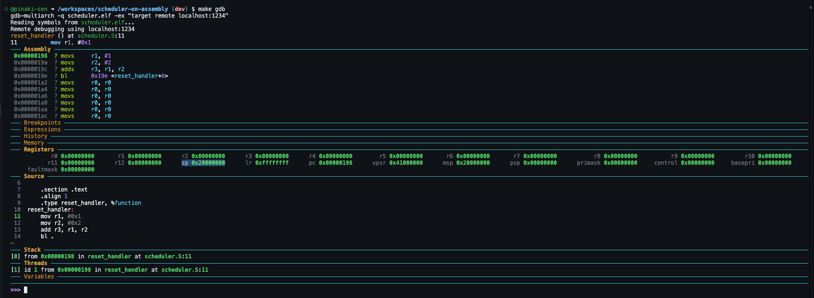
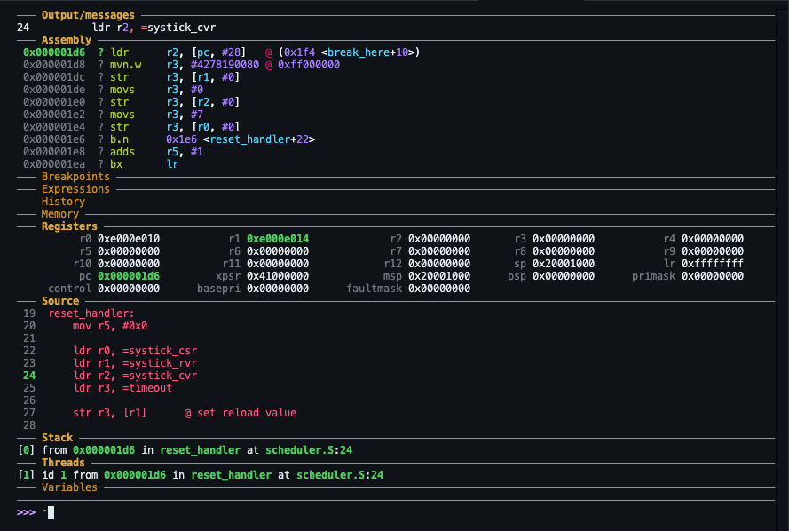
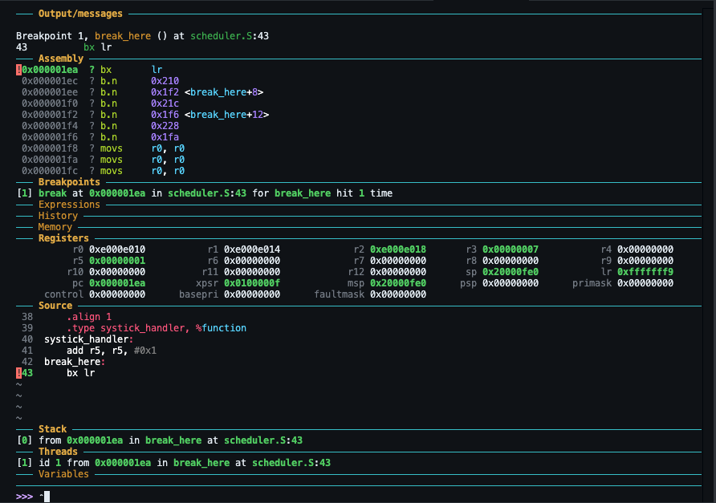
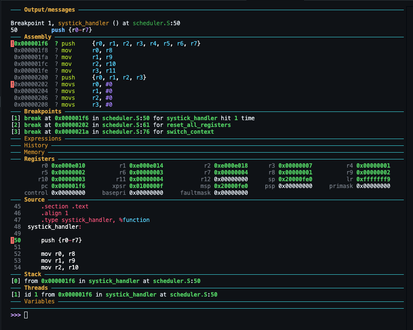
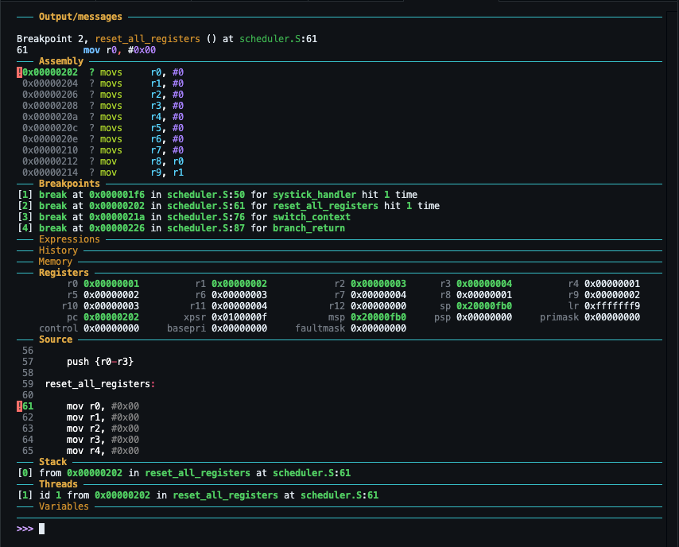
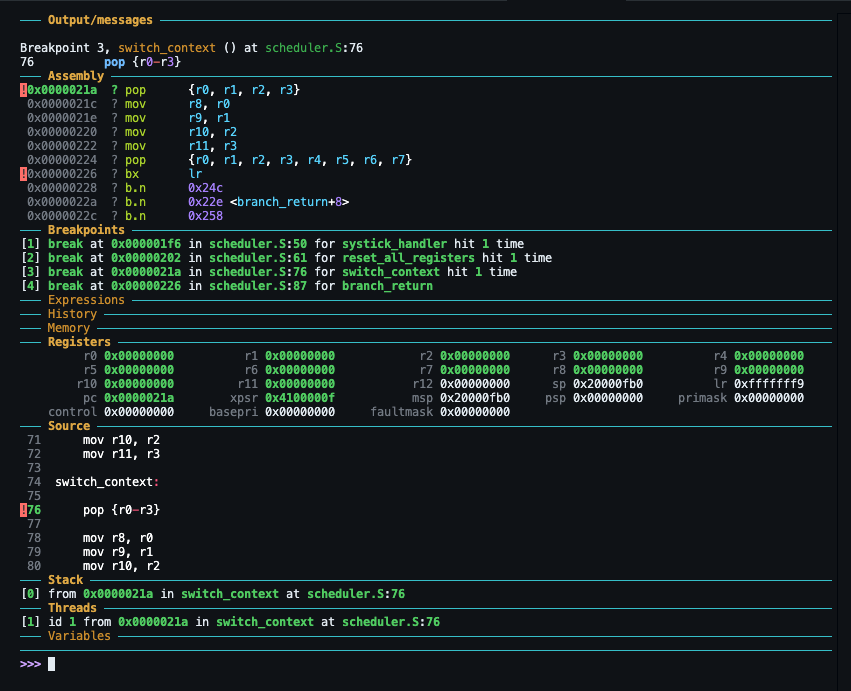
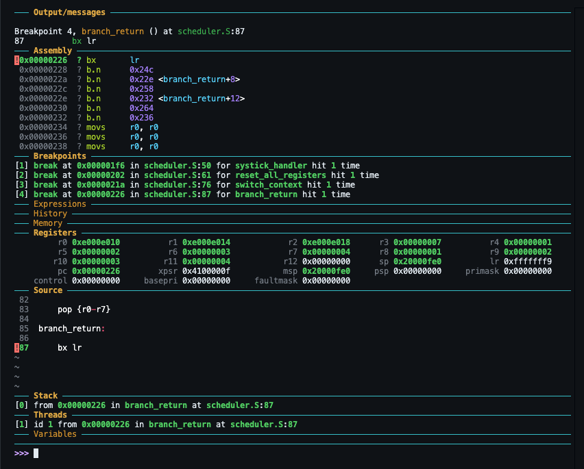

# scheduler-on-assembly
This repo demonstrates implementation of scheduler using assembly code for ARM-M class

---
---
## Environment setup (one time) 

### Install packages
Installing compiler, QEMU and GDB

> `sudo apt update`

> `sudo apt install -y gcc-arm-none-eabi binutils-arm-none-eabi gdb-multiarch qemu-system-arm make`

### Confirm all installations went through (optional)
> `arm-none-eabi-as --version`

> `arm-none-eabi-ld --version`

> `arm-none-eabi-objdump --version`

> `arm-none-eabi-readelf --version`

> `qemu-system-arm --version`

> `gdb-multiarch --version`

### Install GDB dashboard
(This step is optional, doesn't make any functional difference)

The dashboard gives a better visualization of all registers, threads, assembly code while running on QEMU and debugging through GDB. 

Get the .gdbinit file from the repo https://github.com/cyrus-and/gdb-dashboard, 
place it in home directory

Run the below cmd on terminal to add this file path in the environment's .config

> `mkdir -p /home/codespace/.config/gdb`

> `echo 'add-auto-load-safe-path /workspaces/scheduler-on-assembly/.gdbinit' >> /home/codespace/.config/gdb/gdbinit`

### Writing the Makefile

__build:__ creates the object from asmmebly, then the executable and linkable format. Also, `.lst` and .`debug` from the `.elf` for debugging through QEMU and GDB

__qemu:__ starts emulation of ARM cpu on the QEMU on given port

__gdb:__ attaches the GNU debugger to the QEMU execution

__clean:__ removes all the `.elf` `.o` `.debug` `.lst` `.out` etc, basically the files generated during compilation and NOT wrote by us. 

---
---
## CPU Boot up

Next step, we will boot up the CPU by configuring the stack space address and reset handler code. Reset handler will have some demo instructions to execute, which doesn't have any significance in boot process. 

The embedded SRAM in STM32VLDiscovery starts at `0x2000 0000`, therefore we will use this as our initial Stack Pointer. 

In the vector table, at address `0x0000 0000` it will hold the stack pointer and at the address `0x0000 0004` it will hold to address of the instructions to execute during Reset. 

With this, during boot up the Reg SP (Stack Pointer) will hold the SRAM address of `0x2000 1000` and Reg PC (Program Counter) will hold the address to the instruction of our reset handler. 

---
---
## Configuring the sysTick timer
sysTick timer raises an interrupt periodically and executes the code written in the Interrupt Service Routine. 

This concept of periodic interrupt by the sysTick will be used to interrupt the current running thread and switch to next thread in our scheduler. (will come to that in the next section, for now lets configure the sysTick to interrupt and do some simple task)

The code to configure the sysTick timer will be executed as part of the reset_handler, which is the first thing that runs after CPU boots up. 

As seen here, in the reset_handler we are configuring the registers required for the sysTick to work, along with the time period on which we want the sysTick to raise an interrupt. 

Also, we are clearing the reg R5 on the CPU. The ISR will increment it by 1 everytime the sysTick timer hits it. 

Once we put a breakpoint at `break_here` and release the CPU to run, after sysTick configuration is completed in the `reset_handler`, it loops in the branch instruction, until the timer raises interrupt. 

Once the sysTick raises the interrupt, CPU jumps to `systick_handler`, increases the reg `R5` by 1 (as we can see in reg dump) and stops hitting the breakpoint at `break_here`. 

If we keep on continuing from here, everytime timer gets over, sysTick will raise an interrupt, ISR will increase by 1 and timer will get reset and start recounting again. 

---
---
## Push-Pop register to stack, through ISR
In the previous step the same way we were incrementing the reg `R5` in the Interrupt Service Routine, similary we will play around with the registers and stack space in the ISR now. 

Once the CPU starts executing the ISR, all the 12 registers {R0-R11} will be pushed to stack space first, then all reset to 0x00 and finally popped back from stack space to the register. 

To observe this, we will put a few breakpoints in `systick_handler`, `reset_all_registers`, `switch_context`and finally on `branch_return`.  

As we release the CPU to run after reset, the breakpoint at `systick_handler` hits, once the systick raises Interrupt after its timer expiry. This time my Stack Pointer reg `SP=0x20000FE0` and all the registers `{r0-r11}` are holding values as stored in the `reset_handler`. 

Once we continue and hit the next breakpoint at `reset_all_registers`, reg `SP` has changed to `0x20000FB0`. Meaning that the data in register `{r0-r11}` have been pushed to stack and the stack pointer has moved downward by 0x30 bytes, i.e. 4 bytes each for all 12 registers. 

On the next break at `switch_context`, all the register `{r0-r11}` are supposed to be reset 0x00

Finally, on the next break at `branch_return`, all the 12 register data are popped back from stack to the reg {r0-r11}. Registers will now hold their original data again and reg SP again went back upward by 0x30 bytes to 0x20000FE0

Now in the above flow of events, just before popping back the register values from stack to the CPU registers, if we can switch our `Stack Pointer` itself, we can force the CPU to perform some other tasks. Next section, we will use this concept to perform thread switch for our scheduler. 

---
---
